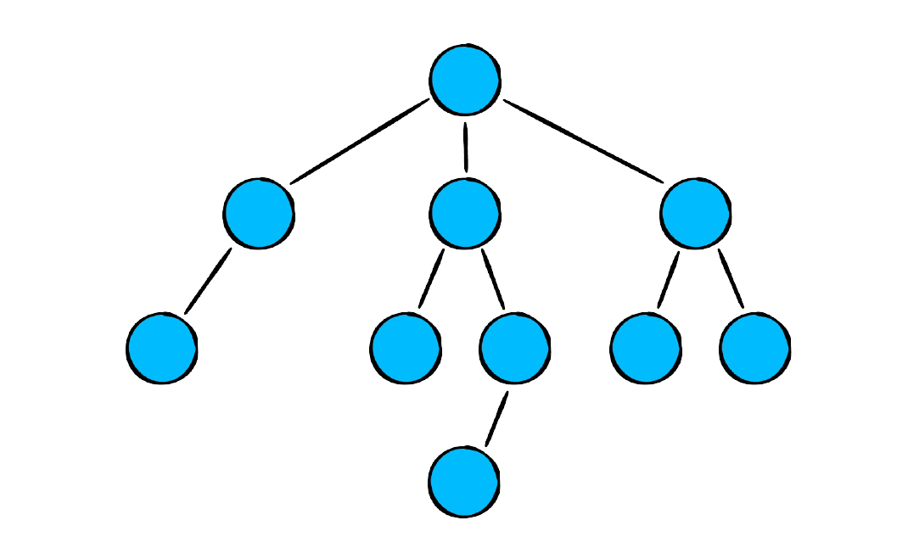

# Swift Data Structures and Algorithms

Data Structure and Algorithm in Swift

## TOC
- Linked List
	 
	
   - Node
- Stack
	 
	
- Queues
   - Queue Array
   	 
	
   - Queue LinkedList
   	 
	
   - Queue RingBuffer
   	 
	
   - Queue Double Stack
   	 
	
- Tree
 

	

## License
[MIT](https://choosealicense.com/licenses/mit/)
